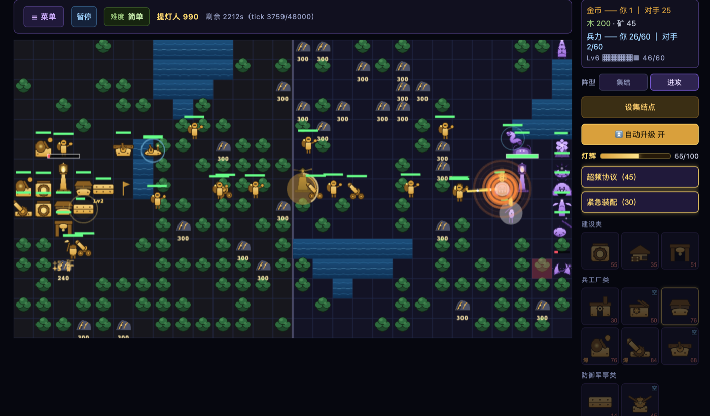
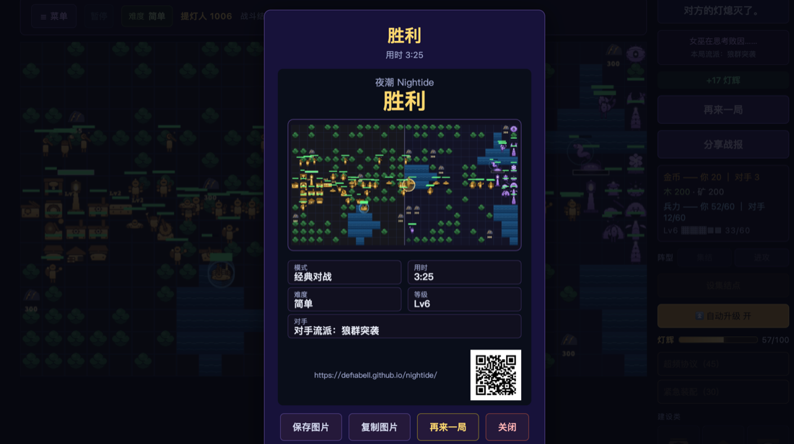

# 夜潮 Nightide

守灯人的长夜——对称自动战争 + 局内轮抽的单机网页游戏。

Nightide is a symmetric auto-war browser game: draft your build, run an economy, and bring down the other side's lighthouse. No download, one match takes about three minutes.

**▶ [在线游玩 / Play now](https://defiabell.github.io/nightide/)** · **[itch.io](https://defiabell.itch.io/nightide)**

发条匠 vs 荆棘女巫：建工厂产兵、采伐森林开路、争夺矿脉，拆掉对方的灯塔获胜。对手是会跨局进化的 AI——普通难度下它会记住上一局赢家的流派并倾向复用。

赢下一局后可以生成一张带二维码的战报卡，直接分享：

本仓库只包含构建产物（deploy artifact），源码不在此仓库。桌面浏览器体验最佳。授权见 [LICENSE](LICENSE)。
